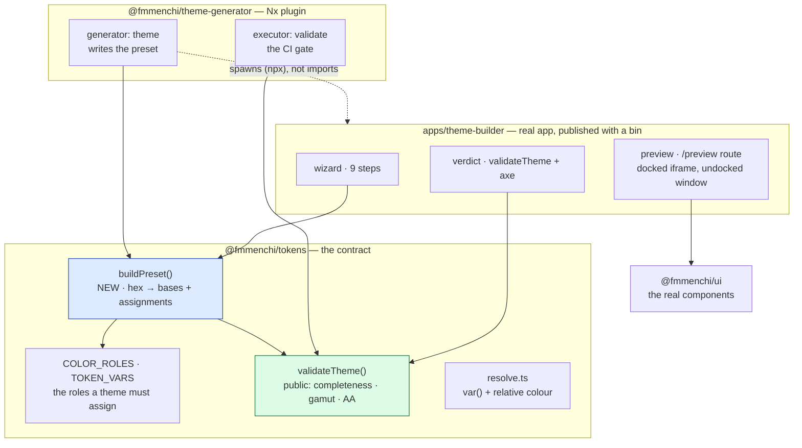
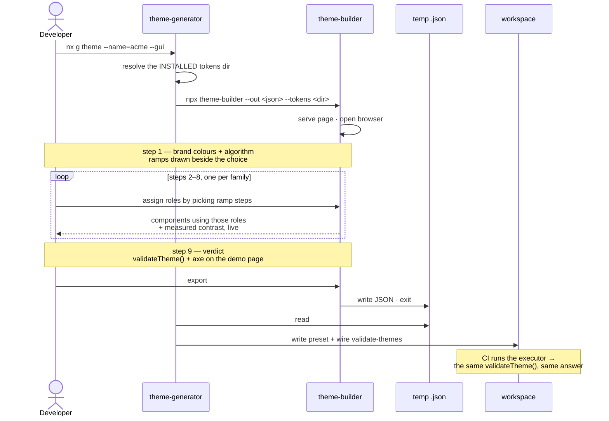

# ADR 0033 — A GUI for the theme generator

- **Status:** proposed (2026-08-30)
- **Date:** 2026-08-30
- **Deciders:** Fabio Menchicchi

## Context and problem statement

`@fmmenchi/theme-generator:theme` scaffolds a brand preset and wires its CI validation. It is
headless, as an Nx generator is, and it emits **the 84 semantic roles copied from the light theme**
with an instruction to edit the values by hand.

[ADR-0032](./0032-tokens-gain-a-primitive-layer.md) made that obsolete twice over. A theme is now
**seven bases** and a handful of role remappings, not 84 literals — and the choices that turn a brand
colour into those seven are not obvious. Measured while building three borrowed themes for the
Storybook demo, three of them go wrong silently:

- **which step a fill points at.** Airbnb's coral is lightness 68%; pinned to the default fill step it
  renders at 41%, a burgundy. The theme looked wrong and the reason was invisible.
- **whether a chroma was a choice or a limit.** Setting every base to the gamut maximum made
  `secondary` identical to `primary` — they share hue 256 — because secondary's 0.04 was a decision
  and primary's 0.118 was the ceiling.
- **which ink a fill can carry.** Coral on white text is 3.05 against a 4.5 floor; on dark text it is
  6.88. Nothing in the CLI tells you that until the gate fails.

All three are visual problems, and all three were caught by looking at a rendering. Hence a GUI: not
as decoration, but because **the feedback these decisions need is a picture, and the generator's
current output is a file.**

## The constraint that decides the architecture

**A faithful preview needs React.** The components' class names are hashed CSS Modules —
`._button_gdl2j_2` — and the hash changes with every build of the stylesheet. A static HTML page
cannot reproduce a Button by writing its markup: there is no stable class to write. Reproducing the
components by hand against `var(--fm-*)` is possible but is a second implementation of every
component, which drifts from the first and hides exactly the defects the preview exists to reveal.

So the preview either mounts the real components, or it is not a preview of this design system.

## Considered options

**Nx Console's form.** Free: the extension renders a form from the generator's JSON schema. Rejected
as insufficient rather than wrong — it gives labelled inputs and no rendering, which addresses none of
the three failures above.

**A preview written in the GUI against the tokens.** Hand-written HTML using `var(--fm-*)`, served as
a static page. Cheap and independent, and it would have shown the coral problem. Rejected: it is a
parallel implementation of Button, Input, Alert and Card that nothing keeps in step with the real
ones. The moment they diverge the preview is lying, and a lying preview is worse than none.

**A dedicated wizard app** (`apps/theme-builder`). Full control over a multi-step flow, real
components, and the plugin stays dependency-free. **Chosen** — the decision below. The cost of
ownership is real and was what an earlier draft rejected it for: a new app to build, test and keep
alive. It buys the one thing neither cheaper option can, which is that the preview _is_ the design
system rather than a drawing of it.

## Decision

**Three parts, and the calculation is the one that matters.**

### 1 · `buildPreset()` in `@fmmenchi/tokens`

A pure function, no DOM, no React:

```ts
type Scheme = 'light' | 'dark';

// ---- the SHAPE of a design system: what the solver is told, not what it makes

/** One rung of a ramp. */
type Rung = {
  /** Its name in the token surface: `700` in `--fm-palette-primary-700`. */
  readonly step: number;
  /** Where it sits — OKLCH lightness, 0–1, ABSOLUTE rather than an offset. */
  readonly lightness: number;
  /** How much of the base's chroma it keeps, 0–1. */
  readonly chromaFactor: number;
};

/** A scheme's ramp. Ordered lightest to darkest; `step` unique within it. */
type Ramp = readonly Rung[];

/** What one role must satisfy, and where the solver looks for it. */
type Constraint = {
  readonly role: ColorRole;
  readonly against: ColorRole;
  /** WCAG floor, or `null` where 1.4.3 exempts the pair (the disabled roles). */
  readonly floor: number | null;
  /** `anchor` is the fill — a choice, not a search. */
  readonly direction: 'anchor' | 'toward-ink' | 'toward-surface';
};

type DesignSystem = {
  readonly families: readonly string[];
  readonly ramps: Readonly<Record<Scheme, Ramp>>;
  readonly constraints: readonly Constraint[];
  /** The two inks a fill may carry — the neutral scale's ends, per scheme. */
  readonly inks: Readonly<Record<Scheme, readonly [light: string, dark: string]>>;
};

// ---- the STATE of a palette: level 1 and level 2, resolved

/** A family's seed — what a brand actually contributes. */
type Base = {
  readonly hue: number;
  readonly chroma: number;
  readonly lightness: number;
};

/** One resolved colour of a ramp. */
type Swatch = {
  readonly step: number;
  /** What gets declared, and what contrast was measured on. */
  readonly css: string;
  readonly lightness: number;
  readonly chroma: number;
  /** True where the gamut, not the curve, decided the chroma. */
  readonly clamped: boolean;
};

type FamilyPalette = {
  readonly family: string;
  readonly base: Base;
  readonly swatches: readonly Swatch[];
};

type Palette = {
  readonly scheme: Scheme;
  readonly families: readonly FamilyPalette[];
};

// ---- the STATE of a theme: level 3, with its reasons

/** How one role got its value, and why. */
type Assignment = {
  readonly role: ColorRole;
  readonly family: string;
  readonly step: number;
  /** `chosen` is the fill, `solved` met its constraint, `pinned` is a person's. */
  readonly origin: 'chosen' | 'solved' | 'pinned';
  /** The measurement that justified it — `null` only for an exempt role. */
  readonly evidence:
    | { readonly against: ColorRole; readonly floor: number; readonly measured: number }
    | null;
};

/** A role no rung could satisfy. Reported, never silently approximated. */
type Unsatisfied = {
  readonly role: ColorRole;
  readonly against: ColorRole;
  readonly floor: number;
  /** The best any rung managed, so the wizard can say how far off it is. */
  readonly best: number;
};

type Theme = {
  readonly scheme: Scheme;
  readonly palette: Palette;
  readonly assignments: readonly Assignment[];
  readonly unsatisfied: readonly Unsatisfied[];
};

/** Both schemes from one set of colours, plus the spec that produced them. */
type Preset = {
  readonly name: string;
  readonly light: Theme;
  readonly dark: Theme;
  readonly spec: ThemeSpec;
};

type ThemeSpec = {
  /** One hex per family — hue and chroma are read from here. */
  readonly brand: Partial<Record<Family, string>>;
  /** Roles pinned to a rung, per scheme: the wizard's own edits. */
  readonly pins?: Readonly<Record<Scheme, Partial<Record<ColorRole, number>>>>;
  /** Constant step is the one that exists; constant contrast when it does. */
  readonly strategy?: 'constant-step' | 'constant-contrast';
};

buildPreset(system: DesignSystem, spec: ThemeSpec): Preset;
```

**`system` is why this is a solver and not our palette with a function around it.**
The rungs and the role constraints arrive as data, so the arithmetic knows nothing
about seven families, nine rungs or the names we happen to use. Three things come
from that, and the third is the one that mattered:

- it is testable against a synthetic system — three rungs and two roles — instead of
  only against the palette whose answers we already know;
- it is reusable by a design system that is not this one, which is the bar
  [ADR-0008](./0008-cross-app-framework-agnostic-layers.md) sets for anything living
  here;
- it settles what `--tokens` is for. The builder resolves the **consumer's
  installed** contract into a `DesignSystem` and solves against that, so a consumer
  whose ramp has different rungs gets their own rungs rather than ours silently
  substituted. Version skew stops being a hazard and becomes the input.

Most of this already exists. `@fmmenchi/tokens` exports the families
(`ACTION_FAMILIES`, `STATUS_FAMILIES`), the roles (`COLOR_ROLES`), and — through
`@fmmenchi/tokens/validate` — the constraints themselves as `CONTRAST_PAIRS`,
`[bg, fg, minimum]` triples derived from the family lists. Two things are genuinely
absent:

- **the rung table.** Which rungs exist and where they sit lives only as CSS text in
  `vars.css`. The proof is that measuring any of the numbers in this ADR required
  parsing the stylesheet and resolving it, which is not something a solver should
  have to do.
- **the direction per role**, so that hover walks toward the ink in light and toward
  the surface in dark. Today that is implicit in the shipped assignments rather than
  stated anywhere.

One table and one field, then, rather than a new contract.

**The types come first, because more than one thing needs them.** The solver
produces a `Theme`, the CSS emitter consumes one, the verdict reads
`unsatisfied` and `evidence`, and the wizard's form is a view over `assignments` —
so these are a shared vocabulary rather than one function's return shape. Getting
them right is the first commit, ahead of any arithmetic.

Three of them are carrying decisions rather than describing data, which is the point
of writing them down:

- `Rung.lightness` is **absolute**, not an offset, so the type states the anchoring
  settled below instead of leaving it to convention;
- `Assignment.origin` separates `chosen` from `solved` from `pinned`, which is
  exactly what the form must show and what makes the state round-trip through the
  generated CSS possible at all;
- `Unsatisfied` is a **field, not an exception**. The requirement that the solver
  say so rather than return a least-bad candidate is enforced by there being
  somewhere for it to say it, and a `Theme` that carries entries here is one the
  verdict must report on.

**`ThemeSpec` is the wizard's form state.** Not a model that mirrors the form —
the form itself. Its three fields are the whole of what a person can change: the
brand hexes, the pins per scheme, and the strategy. Two things follow, and both are
load-bearing rather than tidy. A control that cannot be expressed as a change to
`ThemeSpec` **does not belong in the wizard**, which is the test that keeps nine
steps from growing a tenth out of enthusiasm. And the round-trip closes exactly:
`ThemeSpec` → `buildPreset()` → `Preset` → emitted CSS → `ThemeSpec` read back,
because a role in that CSS is a reference to a rung and a base is a literal. The
form, the preview and the file on disk are three views of one value.

`Constraint.floor: null` is how exemption is expressed, because today an exempt pair
is simply ABSENT from `CONTRAST_PAIRS` — yet a disabled role still needs a
`direction` to be placed, so it needs an entry, and `null` distinguishes "no floor"
from "floor not decided yet".

**And the ramp table must not be hand-maintained.** `Ramp` describes the same rungs
`vars.css` declares, so writing it out by hand makes two copies of the ramp — and a
second copy is how a gate goes green on the wrong number, the exact failure
`resolve.ts` exists to prevent and documents in its own header. Either **derive** it
from the stylesheet at build time or **assert** it against the stylesheet in the
contrast gate; a comment saying "keep in sync" is not one of the options. Per the
repo's own rule all of these live in `*.types.ts`, with `index.ts` re-exporting
them.

`pins` is the parameter the wizard is made of. Without it the function derives a
whole theme from seven hexes, which is the express route; with it, each family step
contributes the assignments a person changed, and the per-role dark deviation has
somewhere to live. It is also what closes the loop with the state decision below:
the pins are recoverable from the generated CSS, because a role there is a reference
to a rung.

`strategy` is passed for the difference that is real — how the rungs are generated —
and not for how a rung's lightness is written, which is settled.

It does what was done by hand for the demo themes: hue and chroma from each hex; the base at the
scheme's lightness, with chroma kept when it was a choice and raised when it was a gamut limit; the
fill pointed at the step nearest the brand colour's lightness; the ink chosen by **measuring**
contrast on that fill; and `validateTheme()` run before returning, so an unusable preset comes back
as an error naming the pair, not as CSS.

It returns structured data — bases, role assignments, and the reason for each — with CSS emission as
a separate function. The GUI needs the reasons to display them; the generator needs the CSS.

This is the only place the arithmetic lives. Both consumers below call it.

### 2 · The generator emits seven bases

`nx g @fmmenchi/theme-generator:theme --name=acme --primary=#635BFF --accent=#00D4FF` writes the
preset `buildPreset()` returns. The rest of the generator is unchanged: the file layout, the
`validate-themes` target, the executor. Existing behaviour with no colour flags stays as it is, so
the change is additive.

### 3 · The GUI is a real app in `apps/`, launched over npx

`apps/theme-builder` — a real application, built the way this workspace builds an
app, not a preview harness bolted to the plugin. It consumes `@fmmenchi/ui` and
`@fmmenchi/tokens` exactly as a consuming app does, mounts the preset under
construction through the **same theme wrapper** a consumer would use, and gives
**each step its own route** instead of hiding panels behind a stepper's internal
state. A step is a page: linkable, reloadable, screenshot-testable, and debuggable
without replaying the eight steps before it.

That is not presentation. The wizard's whole claim is _this is what your theme
looks like in our design system_, and the claim holds only if the thing rendering
it is a real app running the shipped CSS. It is also what makes the preview
impossible to counterfeit: `@fmmenchi/ui` content-hashes its class names, so
nothing outside the package can reproduce them.

**Two routes, two theme wrappers.** The wizard and the demo are the same app on
different routes, and each mounts its own theme. `/wizard/:step` runs on the
reference theme — fixed, known-good, never the one being edited — while `/preview`
runs on the theme under construction. The split is not tidiness. A theme is edited
into a failing state constantly while it is being built, and a wizard wearing it
would go down with it: the contrast error takes away the controls that would fix
the contrast error. The tool has to stay usable exactly when the theme is not.

**Both routes are built with the design system.** The isolation is about which
THEME each one wears, never about which components: the wizard's own stepper,
fields, buttons and dialogs are `@fmmenchi/ui`, pinned to the reference theme. That
matters twice. It is the honest thing — a tool for a design system that reached for
someone else's widgets would be evidence against the system it sells — and it makes
the wizard a consumer, so any gap in the DS surfaces while building it rather than
in somebody's product. What the wizard cannot find in `@fmmenchi/ui` is a finding
about `@fmmenchi/ui`.

**The preview docks, undocks and closes.** `/preview` is a real URL, so one route
serves all three states. Docked, it is an `<iframe>` beside the step. Undocked —
the escape a small screen needs — it is `window.open()` on that same URL, its own
window on its own display. Closed, it is gone and the step has the full width.
An edit reaches an open preview through the regenerated stylesheet, described
below, rather than through a message protocol. The iframe is also what makes the
isolation structural rather than disciplined: a separate document has its own
`:root`, so nothing declared by the theme under construction can reach the
chrome.

**The update path is the generator, not a protocol.** A change in the wizard
pushes no theme object anywhere. It re-runs the same CSS generation with a
different, non-default output target — **the demo app's own stylesheet** instead of
the preset the workspace ships — and the preview updates because that file changed.
The dev server hot-replaces CSS, so the docked iframe and the undocked window both
follow without a reload and without either of them needing to know the wizard
exists.

That buys more than the convenience. The preview is not rendering an in-memory
approximation of the theme; it is rendering **the emitted CSS**, produced by the
same code path that will write the real preset and differing only in where the file
lands. A preview assembled any other way can drift from the output. This one has
nothing to drift from — which is the same argument that rejected a hand-written
preview page, applied one level further down: not just the real components, but the
real stylesheet.

**The generated CSS is the state; the form is a projection of it.** The wizard
keeps no parallel model of the theme. It **reads what was generated**, and the
controls are populated from that file — so re-running generation is not "saving",
it is the single act that updates both the demo app's theme and the wizard's own
form. There is no synchronisation between them to get wrong, because there is only
one artefact.

This is only possible because of [ADR-0032](./0032-tokens-gain-a-primitive-layer.md).
A generated preset holds its bases as literals (`--fm-palette-primary-base: oklch(55%
0.19 27)`) and its roles as **references** to a rung: 83 of the 84 are a plain
`var(--fm-palette-primary-700)`, and the 84th, `scrim`, is a rung with an alpha
applied. **No role invents a colour.** So the inputs are recoverable from the output
exactly: the bases give each family's hue and chroma, and the role references give
the rung. When the roles held 84 literals this
would have been impossible; you could read a theme's colours but never its
decisions.

Three things follow for free. Reloading on step 5 restores the wizard, because the
state was never in the page. The undocked window and the docked iframe cannot
disagree, because neither holds state. And "what you see is what you will get" is
structural rather than maintained — the preview and the form are two views of the
file the generator will hand back.

**What that forces on a generated preset — measured, not assumed.** Each family
step also shows components inline, inside the wizard's own document, where the
theme is a container rather than a root. A custom property resolves where it is
DECLARED, and the ramp is relative colour off the base, so overriding the seven
bases on a container is **inert**: the ramp already settled at `:root` and does not
re-derive. `packages/client/ui/src/docs/scoped-theme.test.tsx` measures both
halves — a base override alone leaves every step unchanged, while the same override
declared together with its ramp moves the family, and a sibling container keeps the
root theme. So `buildPreset()` must emit the whole block (bases, ramp and roles)
under a selector that can sit on a container, which is the shape
`[data-theme='dark']` already has. Seven numbers are what a person chooses; a block
is what gets written.

It ships a `bin`, so it runs two ways:

```bash
nx g @fmmenchi/theme-generator:theme --name=acme --gui   # the generator launches it
npx @fmmenchi/theme-builder                              # or a person runs it directly
```

**Why not a Storybook story**, which was the earlier draft here: the story serves
only this repository. `theme-generator` is a PUBLISHED plugin whose users are
apps bringing their own brand, and those apps do not have our Storybook. A
published app reaches them; a story does not. The story would also have grown into
an eight-step application inside a `.stories.tsx`, which is the wrong container
for it.

**The contract between the two is a file, not a socket.** The generator creates a
temp path, launches the builder with it, and waits:

```
theme-builder --out <path>.json --tokens <resolved @fmmenchi/tokens dir> [--name acme]
```

The builder serves its own page, opens a browser, and on submit writes the JSON
and exits. The generator reads the file and writes the preset into the workspace.
No HTTP between processes, no port negotiation across a boundary, and each half is
testable on its own: the builder against its JSON output, the generator against a
JSON fixture.

`--tokens` matters: the builder shows the CURRENT palette of the consumer's
installed contract, not ours. It reads the stylesheet it is pointed at, the same
way the generator already reads the installed contract.

**Two routes through it, one implementation.**

_Express_ — two steps. Give the colours, see the preview and the verdict, export.
Everything between is the derived default: the fill on the step nearest the
brand's lightness, the ink measured, the dark half mirrored. This is the route for
someone who wants their brand applied and trusts the derivation.

_Full_ — the nine steps below, one family at a time.

They are the SAME wizard: express is the full route with steps 2–8 accepted as
they come. Not a second flow — a skip. Two flows would mean two sets of defaults
to keep in agreement, and the moment they disagree the express route becomes a
trap ("it looked right in the quick one").

A third level is worth naming and not building yet: editing the CURVE itself —
the lightness offsets and chroma coefficients, not just which step a role picks.
That is the control a design-system owner wants and an app consumer does not, and
it belongs behind the same door as the algorithm choice. Deferred until someone
asks for it, because a knob that reshapes every family at once needs the
whole-page preview to be trustworthy first.

**The full route: nine steps.**

_Step 1 — the palette._ Brand colours, the ALGORITHM, and the ramps drawn beside
them. The algorithm is a real choice: _constant step_ (what ships — fixed
lightness offsets, families aligned with each other, contrast verified afterwards
by the gate) or _constant contrast_ (the Leonardo model — each step defined by the
ratio it must clear, so a step IS a guarantee, and a fill that cannot carry its
ink cannot be generated). Neither is better; exposing the choice beats picking one
and hiding it, and this is the step where the cost of each is visible because the
ramps are right there.

_Steps 2–8 — one per family_ (`primary`, `secondary`, `accent`, `negative`,
`success`, `warning`, `info`). Roles are assigned by **picking steps from the
palette**, not by choosing free colours — the Radix model, and what stops a theme
drifting off its own scale. Each step shows the family's ramp with the current
assignment marked, the components that actually use those roles, and the measured
contrast of every pair it touches.

_The demo page_, from step 1 onward: header, cards, a form, alerts, assembled from
real components, because a theme is judged as a page. It is where the failure this
exists to catch appears — the coral theme's `primary` and `destructive` are both
warm reds, invisible in a palette and obvious next to each other on a page.

_Contrast is checked in every step, not only at the end._ Each family step
measures the pairs it touches, live, as the assignment changes — the ratio beside
the swatch, and the floor it has to clear. A step that would drop a pair below AA
says so while the choice is being made, which is the difference between a wizard
and a form.

_Both schemes, from the same seven colours._ A brand's hues do not change between
light and dark — what changes is where the bases sit (55% against 75%), the curve
(0.10 against 0.05, because dark works against the lightness ceiling) and which
step each role picks. So the wizard asks for the colours ONCE and derives both
presets; asking twice would be asking a person to re-enter the same hexes.

Every family step carries a light/dark toggle showing the same assignment in both,
because an assignment that reads well in one can fail in the other: that is
precisely how the dark preset produced 20 contrast regressions when it was first
levelled. The neutral ramp is shared between the schemes and is shown once.

Dark is DERIVED and then adjustable, not asked for. The default is the mirrored
mapping — fill, then a step lighter for hover, a step lighter again for active,
the wash at the far end — and a person can move any of it, in that step, with the
contrast measured beside it.

_Step 9 — the verdict._ Every declared pair with its ratio, and one sentence at
the top: this theme is AA, or these pairs are not. Two levels, because they catch
different things:

- **the contract**, via the public `validateTheme()` — the same function the
  `validate-themes` target runs in CI, **on both schemes**: a theme is not AA
  until its dark half is too. Not a second implementation: if the
  summary says AA and the pipeline disagrees, the summary is worthless, so it has
  to be the identical check.
- **the page**, via axe on the rendered demo. This finds what the pair list
  cannot — a combination no pair declares, or two roles that pass individually
  and are indistinguishable from each other. The coral theme's `primary` next to
  its `destructive` is exactly that: both clear AA on their own, and a person
  cannot tell the submit button from the delete button.

The verdict is a report, not a lock. A theme with a failing pair can still be
exported — the CSS is written, the failure is stated, and the CI gate will say
the same thing. Refusing to export would only teach people to bypass the tool.

_Exit at any step_ with the CSS or the `nx g` command. The wizard is a place to
see, not a gate to pass.

**Where it lives.** `apps/theme-builder`, tag `scope:app` — and, unlike the two
apps already there, **published**, with a `bin`. It depends on `@fmmenchi/ui` and
`@fmmenchi/tokens`: an app sits at the top of the graph and may depend on any
layer, while the module-boundary rule forbids the reverse, so nothing in the
published layers can reach back into it.

`packages/` was the other candidate and loses on both counts. The `tools` scope has
**no members today**, so a tool-shaped home means standing a scope up for one
project; and the thing genuinely is an application — a browser, routes, a server —
which is what `apps/` exists to hold ([ADR-0020](./0020-where-things-live.md)).

**This refines ADR-0020, it does not contradict it.** That decision draws its line
at _layers_: `packages/` is the published **layer** surface and `apps/` is not a
layer. Publishing a tool from `apps/` does not make it one — nothing imports it,
the generator spawns it as a process, and the boundary rule keeps the graph
one-way. What does have to change is mechanical: the release set is the glob
`packages/*/*`, so this app needs its own release group in `nx.json` and must trade
`private: true` for the `publishConfig.registry` every published package here
carries.

### The default map is solved, not tabulated

Which step a role points at is the wizard's real product: on the express route
steps 2-8 are accepted as they come, so the defaults **are** the theme for most
people. Two published systems answer this, and they answer it differently.

[Radix Colors](https://www.radix-ui.com/colors/docs/palette-composition/understanding-the-scale)
gives each of its twelve steps a fixed meaning — 9 solid background, 10 its hover,
11 low-contrast text, 12 high-contrast text, 3/4/5 the UI backgrounds, 6/7/8 the
borders. The guarantee does not come from the map: it comes from Radix hand-tuning
all thirty of its scales until those meanings hold.
[Material 3](https://m3.material.io/styles/color/roles) makes it arithmetic
instead — tones are distributed so that **40 apart is at least 3:1 and 50 apart at
least 4.5:1** — so a map written as tone distances is accessible by construction
rather than by craftsmanship.

**Neither transfers here as a table, and the reason is measured.** Our ramp is
_offsets_ from the base (`calc(l + 0.35)`, `calc(c * 0.22)`), so a brand's
lightness, chroma and hue all ride through it. Sweeping 245 bases — seven
lightnesses by five chromas by seven hues — through the shipped light offsets:

| what varies        | effect on the distance guaranteeing 4.5:1      |
| ------------------ | ---------------------------------------------- |
| hue                | none                                           |
| chroma             | none                                           |
| **base lightness** | **6 inside roughly L 0.45–0.68, 7 outside it** |

174 of the 245 landed on 6 and 71 on 7. Worse for a table, the **dead zone** — the
step that carries neither white nor dark ink at 4.5 — walks with the base: step 200
at L 0.35, step 400 at 0.55, step 700 at 0.75, and at some lightnesses there is no
dead step at all. A map of absolute step numbers is therefore only as good as the
bases underneath it, and the bases are precisely what a brand changes.

**So the default is a declared constraint and a solved step.** Each role carries
what it must satisfy — this fill must carry its foreground at 4.5, this border must
reach 3 against its surface — and `buildPreset()` walks the ramp for the nearest
step that satisfies it **on the actual colours**. This is not Leonardo, which
solves for the COLOUR given a target contrast and would mean a new colour engine;
it solves for the STEP given a ramp we already have, which is arithmetic we already
do in the gate.

Two things follow. When no step satisfies a constraint — a pale brand where nothing
carries white ink — the solver must **say so** rather than return the least-bad
candidate: that is the moment this whole tool exists for, and it is the one the
coral would have raised instead of shipping a burgundy. And the numbers above are a
**calibration, not a rule**: on today's bases the solver should land on 6 and 9, so
they belong in the contrast gate as a fixture, where a retune that quietly moves
them gets caught.

#### The spec stores decisions, not the matrix

A fair question is why `ThemeSpec` holds seven brand colours plus a handful of
edits rather than the whole resolved matrix — all the rungs and all 84 roles,
exactly what a person approved.

**Because storing the matrix restores the problem this began with.**
[ADR-0032](./0032-tokens-gain-a-primitive-layer.md) took 168 hand-maintained colour
literals to zero, and the property that bought is the one `token-overrides.test.tsx`
measures: change a base, the family follows. With a frozen matrix, changing a base
does nothing — every value is already fixed — so a rebrand goes back to being 84
edits instead of seven. `Swatch.origin` and `Assignment.origin` would lose their
meaning too: if everything is stored, there is no way to tell a decision from a
derivation.

**And the matrix already exists.** It is the emitted CSS, committed in the
consumer's repository. The spec is the INTENT; the CSS is the RESULT. Holding the
matrix in both makes two sources of truth for one fact, which is the thing
`@fmmenchi/tokens` refuses on principle — a file that only restates the contract is
generated, a file that decides something is written.

**The risk behind the question is real, though.** A spec of deltas re-derives, so a
change to the solver moves a theme under whoever approved it. The answer is not a
second copy of the values: it is to **diff the freshly derived matrix against the
committed CSS and report what moved**. Same mechanism as the verdict, no new field,
and it turns a silent drift into a reviewable one. A regeneration that changes
nothing says so; one that moves eleven roles says which eleven.

#### One choice per family, seven solutions

An action family declares eight roles, and exactly **one** of them is a choice.
That is what makes "a theme is seven numbers" an honest description rather than a
slogan.

| role                   | how it is fixed                                                     | constraint                                                          |
| ---------------------- | ------------------------------------------------------------------- | ------------------------------------------------------------------- |
| the fill               | **chosen** — the rung whose lightness is nearest the brand colour's | must be able to carry an ink at 4.5                                 |
| `-foreground`          | solved                                                              | ≥ 4.5 against the fill; candidates are the neutral scale's two ends |
| `-hover`               | solved                                                              | one rung along the scheme's direction, its ink still ≥ 4.5          |
| `-active`              | solved                                                              | one rung beyond hover, its ink still ≥ 4.5                          |
| `-subtle`              | solved                                                              | a tint at the far end, solved WITH its ink so the pair clears 4.5   |
| `-subtle-foreground`   | solved                                                              | ≥ 4.5 against `-subtle`                                             |
| `-disabled`            | solved                                                              | exempt — WCAG 1.4.3 places disabled controls outside the floor      |
| `-disabled-foreground` | solved                                                              | exempt, likewise                                                    |

The direction belongs to the **scheme**, not the family: light darkens for hover and
active and takes the light end for `-subtle`; dark lightens and flips `-subtle` to a
dark wash with light text, which is what the shipped dark preset already does.

Two properties fall out of this shape. The brand's **lightness is spent on the fill
choice**, which is the one place it belongs — the coral failure was spending it
nowhere and pinning the fill to a fixed rung, so a colour at L 0.68 rendered at
0.41. And every failure is **attributable**: the solver names the role, the pair and
the floor it could not reach, instead of producing a theme that has to be
interrogated afterwards to find which of 84 values is the bad one.

So a family's whole input is three numbers — hue, chroma, and which rung the fill
takes — and the seven families make the "seven numbers" of this ADR literal.

#### Why theirs tabulates, and why that is not a fork

Worth recording, because someone will otherwise re-derive it.

[Radix](https://www.radix-ui.com/colors) publishes thirty hand-authored scales —
you do not generate them — but the values are not arbitrary: steps 11 and 12 are
guaranteed to **Lc 60 and Lc 90 APCA** above step 2 of the same scale, and their
custom-palette tool reproduces comparable ratios for a new colour. The values are
fixed; the _targets_ are the invariant.
[Material 3](https://m3.material.io/styles/color/roles) generates instead, and its
invariant is structural: HCT's tone **is** CIELAB `L*`, hue and chroma come from
CAM16, and chroma is reduced until the colour fits the gamut. Because the tone axis
IS absolute lightness, a distance in tone is a distance in lightness for any source
colour — which is the only reason the 40 / 50 rule can be published.

Ours has Material's constant step but anchors it as **offsets from a per-family
base**, so a rung's absolute lightness moves with the base. Measured over 648 bases
(9 lightnesses × 8 chromas × 9 hues), the same nine rungs under both anchorings:

| anchoring                | gap guaranteeing 4.5:1  | dead zone                     |
| ------------------------ | ----------------------- | ----------------------------- |
| offset (today)           | 6 ×424, 7 ×224 — varies | moves across 200…700, or none |
| absolute (Material-like) | **6 ×648 — invariant**  | stable at 400 (639 of 648)    |

**A palette is a palette, so this is a strategy and not a schism.** What the design
system consumes is a list of rungs per family; how a rung was computed — an offset,
an absolute anchor, a hand-written literal, an uneven step — is the derivation's
business and invisible downstream. `buildPreset()` already takes the strategy as a
parameter, and the solver reads the ACTUAL colours, so it is correct on any rung
list, evenly spaced or not.

**And the two are not even exclusive.** Relative colour admits a literal channel,
so a rung can anchor its lightness absolutely and still read hue and chroma from
the base:

```css
--fm-palette-primary-700: oklch(
  from var(--fm-palette-primary-base) 0.41 calc(c * 0.96) h
);
```

Verified in a browser rather than in the resolver, since the browser is what ships
(`scoped-theme.test.tsx`): that form resolves, it agrees with today's
`calc(l - 0.14)` at a base of L 0.55, and it still follows the base's hue. So the
lightness can be pinned — which is what makes the distance invariant — while the
base keeps carrying hue and chroma, which is what keeps ADR-0032's promise that
overriding a base moves the whole family. Nothing is traded.

**Which reframes the freedom question.** The worry is that pinning lightness takes
control away. It does not take it from the base, per the above; what it constrains
is the set of lightnesses a family can reach. Sixteen published brand colours
snapped to the nine rungs: **fifteen land within ΔL 0.05** (worst 0.048 — Airbnb
Babu, Duolingo green), the theoretical worst case being 0.05, half the widest rung
gap. The one real casualty is **pure black**: `#000000` sits ΔL 0.22 from the
darkest rung, though brand "blacks" that are not literally black land within 0.023
(Notion 0.213, Spotify 0.197). For scale, the coral failure this ADR opens with was
ΔL **0.279** — its nearest rung is 0.011 away.

So the constraint is the **range's ends, not its granularity**, and it is a question
about which rungs exist rather than about the anchoring: a ramp whose floor is 0.22
cannot reproduce black under either model. The freedom the shipped palette actually
uses today is **0.06** — seven bases spanning L 0.54–0.60 out of the ~0.68 the ramp
covers.

**So: Radix's principle, Material's mechanism, one anchoring.** Radix's model
cannot be adopted as a method — it needs a person tuning each scale until the
targets hold, and a consumer's brand scale is generated at wizard time precisely
because nobody is going to hand-tune it. What transfers is its _principle_, that a
rung's meaning is a declared contrast target rather than a position, and that is
already the decision above. Material contributes the mechanism that satisfies such
a target by construction: pin the lightness.

Both anchorings should NOT be kept as a product choice. The literal-channel form
removes the reason to — it delivers the invariance and keeps the base carrying hue
and chroma — and a knob that silently varies whether the contrast guarantee holds is
a knob nobody can evaluate. This ADR already refuses the same shape twice: two
wizard routes are one implementation, and two derivation algorithms are called out
as two things to keep correct. The `strategy` parameter stays for the difference
that is real — constant step against constant contrast — not for how a rung's
lightness is written.

Changing that channel edits the shipped `vars.css`, so it is a follow-up to
[ADR-0032](./0032-tokens-gain-a-primitive-layer.md) rather than part of this
decision. The solver is correct before and after, which is why it does not have to
wait for it.

### Dark mode — two independent switches

"Dark" means two different things in this app, and conflating them is the obvious
bug.

**The chrome's scheme is the person's own preference.** The wizard is one of our
apps, so it supports dark mode the way our apps do: the reference theme it wears
has a dark preset, and the app follows the operating system unless the person says
otherwise. This has nothing to do with the theme being built. Someone working at
night builds a light theme in a dark wizard, and neither switch moves the other.

**The previewed scheme is a control on the preview.** Docked or undocked, the
preview carries its own light/dark switch, and the inline components in each family
step follow it. That is the switch that matters to the work, and it is deliberately
not the chrome's.

**Dark is derived; the toggle is a view, not a second editor.** Both schemes come
from the same seven colours — a brand's hues do not change between them — so the
person assigns once. What differs is the methodology, and it is not a shared
number: the light ramp has 9 steps at 55% bases, the dark ramp has 13 at 75%, so
"primary → 700" is meaningless across the two. `buildPreset()` therefore takes the
scheme and emits a role-to-step map per scheme; the wizard shows the dark result
and **measures its contrast in the same step where the choice is made**. That is
the whole reason the toggle exists: an assignment that reads well in light and
fails in dark is exactly how the dark preset produced 20 contrast regressions the
first time it was levelled, and the only fix is to see it while choosing rather
than in a verdict eight steps later.

**The escape hatch is per role, and it is visible.** When the derivation is wrong
for one role in one scheme, that role can be pinned to a different dark step —
reachable only while dark is showing, recorded as a deviation, and listed as such
in the final verdict. A deviation you can see is maintainable; a silently
hand-tuned preset is the 84-literal problem coming back one role at a time.

### The demo app, and what it has to cover

The preview is a **fake product**, not a component gallery: sections of a plausible
application, composed of `@fmmenchi/ui` components that actually consume the family
under discussion. A gallery would be cheaper and would hide the exact failures this
tool exists to catch — a swatch on a neutral ground always looks fine, while
`primary` sitting next to `destructive` in a real toolbar is where a person
discovers they cannot tell submit from delete.

So the sections follow the families. Action families (`primary`, `secondary`,
`accent`, `destructive`) live where actions do — a toolbar, a form's submit and
cancel, a destructive confirm, links in prose. Status families (`success`,
`warning`, `info`, `error`) live where feedback does — validation on a form, alerts,
an empty state, a banner. Each family step points the preview at the sections that
use it rather than describing them.

**"As much of the DS as possible" is a measurement, not an aspiration.** The verdict
runs axe on this page, so a role the page never paints is a role the verdict cannot
vouch for. The demo therefore reports its own **role coverage** — how many of the 84
roles were actually painted — and the verdict states it. A theme that passes on a
demo covering 60 roles has been checked less than one covering 80, and saying so is
the difference between a verdict and a reassurance.

Two details an implementer will hit immediately. The families of ROLES are eight
(four action, four status) over **seven palette families**: `destructive` and
`error` share `negative`, deliberately — same red, different treatment, an action
having hover and active where a status has a subtle wash and a border. A wizard step
is therefore a **palette** family, and the `negative` step assigns both. And the
**neutral scale is fixed**: it is not a brand's to move, it is shared by both
schemes, and every family already measures its ink against its ends. It appears in
the wizard as context, never as a control.

### What is deliberately NOT built

**The generator does not host the GUI.** It launches a separate process and reads a
file. Everything a browser needs — a server, a port, a bundled page — belongs to
the builder, which is an application and can own those things; a generator that
grew an HTTP server would be a generator with a second job.

**No live round-trip.** The builder does not write into the workspace and the
generator does not stay open while a person clicks. One handoff, one file. A
watch mode where edits land in the repo as they happen is a different tool and a
much larger promise.

Which is not in tension with regenerating CSS on every change: that file is **the
builder's own demo stylesheet**, inside its own app, and it is disposable. The
CONSUMER's repository is written exactly once, by the generator, from the JSON the
builder leaves behind on exit. Two very different files, and only one of them is
somebody's source tree.

## Architecture



`buildPreset()` is the only place the arithmetic lives, and `validateTheme()` the
only place the verdict does — both the wizard and CI call the same one, which is
what stops the tool from promising what the pipeline refuses.

**That last claim is not true yet, and it is the open decision this ADR leaves.**
`validate.ts` contains no APCA: `validateTheme()` measures WCAG AA only. But
`tokens.test.ts` additionally enforces an **APCA floor of |Lc| ≥ 45 as a hard
failure** over the same `CONTRAST_PAIRS`, logging |Lc| < 60 as advisory. So the
pipeline demands strictly more than the verdict, and a generated theme can pass the
wizard and fail the repository's own gate — the precise failure the single-function
architecture exists to prevent.

Three ways out, and the choice is a decision rather than a detail:

1. **Move the APCA floor into `validateTheme()`.** The one-function claim becomes
   true, the wizard measures APCA in every family step alongside WCAG, and
   `Constraint` carries both metrics rather than a single `floor`. The code already
   exists; it is in the wrong file.
2. **Leave it in the test** and downgrade the claim honestly: the wizard checks
   WCAG, CI checks WCAG and APCA, and the gap is documented so nobody is surprised
   by a red pipeline on a green theme.
3. **Drop the APCA hard floor**, keeping it advisory. Cheapest, and it discards a
   check that exists because WCAG 2.x is a blunt instrument on dark themes — which
   is the case this ADR cares most about.

The recommendation is (1). It is the only one that leaves the architecture's spine
intact, and the type change it forces — a constraint with two metrics instead of one
number — is a truer description of the policy this repo already runs than the single
`floor` currently written above.

The dashed edge is the important one: the generator **launches** the app as a
process, it does not import it. That is what keeps a browser, a port and a bundle
out of the plugin.

## The flow



Exit is possible at any step: the wizard is a place to see, not a gate to pass.
Contrast is measured in every family step, not only in the verdict — a choice
that drops a pair below AA says so while it is being made.

## Consequences

**`culori` becomes a runtime dependency of `@fmmenchi/tokens`**, which today has none. The gamut
search and the contrast measurement need it, and reimplementing either is how a resolver starts
asserting its own arithmetic. Two ways out if the weight is unacceptable: ship `buildPreset` from a
subpath so importers of the token names do not pay for it, or move it to a `bin` — the workspace has
that pattern in `@fmmenchi/ci`. Decide when measuring the bundle, not before.

**The plugin gains a dependency on `@fmmenchi/tokens`.** It generates themes for that contract, so it
is not a foreign dependency; and it already reads the installed contract at generation time.

**`apps/` gains its first published project.** `nx.json` grows a release group for
`apps/theme-builder`, and the app trades `private: true` for a `publishConfig`
registry. The release set stops being the single clean glob `packages/*/*` — that is
the real price of this placement, and it is paid once. The docs site and the
ports-validation app stay unpublished and stay outside the release set.

**The wizard is an app to keep alive**, with its own build, tests and dependency
surface. That is the cost the earlier draft rejected it for, and it is not
recovered by cleverness — it is accepted, because a preview that is a separate
implementation of Button and Input is a preview that lies the day it drifts.

**Two algorithms mean two implementations to keep correct**, and the second one
does not exist yet. `buildPreset()` takes the strategy as a parameter; constant
step is the one in use and the one the round-trip test pins. Constant contrast
lands with the wizard or after it, and until it does the wizard offers one
choice — which is honest, where a disabled radio button implying a missing
feature would not be.

**The story is a dev tool that ships nowhere**, like the rest of Storybook. The borrowed-brand
palettes stay in the demo story and out of the package, for the reason recorded there.

## What gets tested

- `buildPreset()` regenerates the presets this repo already ships, from their own brand colours. That
  is the test that matters: it ties the generator to a truth already in the repository rather than to
  a snapshot of itself.
- Every preset it emits passes `validateTheme()` — asserted on the three demo brands, whose colours
  include the two cases that break naive derivation (a pale fill, and two families sharing a hue).
- The generator's existing spec keeps passing with no colour flags.
- The builder story renders, via the story test run.
- A preset scoped to a CONTAINER re-derives its ramp and its roles, a sibling
  container keeps the root theme, and a base override alone is inert — the
  cascade facts the wizard's two-theme document depends on
  (`scoped-theme.test.tsx`, written before the app exists because it constrains
  what `buildPreset()` may emit).
- The wizard's step logic is unit-tested where it decides something: which steps a
  family may point at, and what the contrast of an assignment is.
- The final verdict agrees with `validateTheme()` by construction, since it calls
  it — asserted on a theme built to fail, so the summary is known to report a
  failure rather than only to pass on good input.
- The handoff: the builder's JSON against a schema, and the generator against a
  JSON fixture. Each half testable without the other.
